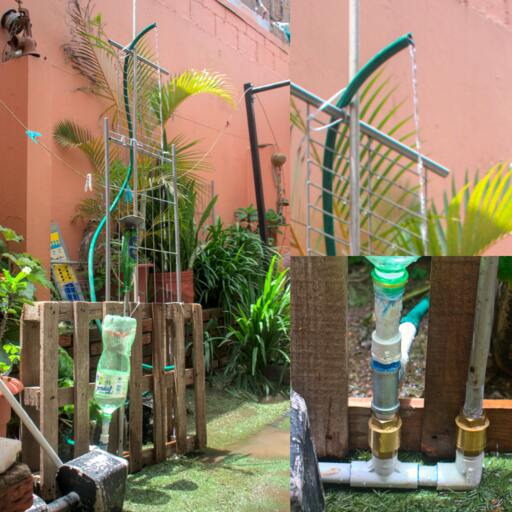

+++
title = 'Bomba de Golpe de Ariete (Water Hammer): Análisis Histórico y Práctico'
author = 'Gustavo Calvo'
date = 2025-06-01T09:00:00-07:00
draft = false
tags = ['Dinámica de Fluidos']
+++

# &Iacute;ndice

1.  [Introducción](#org45dfa44)
2.  [Historia](#org679078f)
3.  [Diseño](#orgc6dee3a)
4.  [Breve experimento](#org55b82f4)
5.  [Conclusiones](#orgd20622c)
6.  [Referencias](#orgb1a21a9)

> Este estudio se centra en la investigación de aspectos prácticos y teóricos del
> dispositivo hidráulico conocido como &laquo;bomba de golpe de ariete&raquo;. Un método usado
> para llevar agua a una mayor elevación que la diferencia de altura entre una fuente
> de agua y la bomba de golpe de ariete, aprovechando la energía cinética del
> flujo en tuberías en forma de presión.
> La bomba de golpe de ariete es un mecanismo que ha sido empleado históricamente
> para trasladar agua en situaciones donde la disponibilidad de energía eléctrica o
> combustible es limitada o inexistente. Actualmente es una solución establecida con
> múltiples modelos que emplean el mismo concepto sencillo, pero con mejoras en los materiales
> de las piezas, por ejemplo, para evitar fugas o aumentar la capacidad de presión.
> Aquí se explora cómo los marcos teóricos desarrollados por Joukowsky
> pueden ser aplicados a desafíos prácticos en áreas aisladas y se indaga sobre
> la viabilidad de la implementación de acuerdo a disponibilidad de piezas,
> documentación y dificultad de ensamblado.

# Introducción

El dispositivo conocido como *bomba de golpe de ariete*, es una aplicación del fenómeno
del *golpe de ariete* o *hydraulic ram* como se denominaba desde el siglo XIX.<a href="#citeproc_bib_item_1">1</a>
El orgien exacto de esta idea, o del fenómeno que la causa no es conocido con certeza, pero
múltiples ensayos mencionan posibles teorías que aquí se intentan ordenar de forma objetiva.
Principalmente, se destacan las ecuaciones fundamentales de Joukowsky ya que en la modernidad
son la base del estudio de este fenómeno.

La dispocición típica de una bomba de golpe de ariete posee una suministro de fluido (incompresible),
una cámara de compresión (con fluido compresible), y una regulador de fluido comúnmente llamado
válvula de tipo check, una pieza que permite el paso de fluido solamente en una sola dirección.<a href="#citeproc_bib_item_2">2</a>
Más adelante se detalla cómo este prototipo se puede modelar y construir de manera sencilla. A pesar
de que las ecuaciones que describen su comportamiento son complicadas de derivar, se pueden aplicar
de manera sencilla para verificar el funcionamiento seguro y eficiente del aparato.

Este fenómeno es una consecuencia del principio de continuidad, ya que ocurre al reducir
considerablemente la velocidad de un líquido incompresible, aumentando su presión. Este
&laquo;choque&raquo; genera ondas de presión en el líquido, las cuales afectan de alguna manera el
sistema en el que se encuentran (usualmente una tubería). El dispositivo en cuestión, busca
aprovechar las ondas de presión de este fenómeno para guardar la energía en un reservorio
con fluido compresible. El aprovechamiento del exceso de presión es lo que permite bombear
el fluido, no obstante, cuando ocurre de manera inesperada, puede ocasionar daños irreparables
a los sistemas hidráulicos.<a href="#citeproc_bib_item_3">3</a>

# Historia

El análisis de la física de fluidos es complejo, en algunos casos abierto a amplio debate como 
el artículo &laquo;No one can explain why planes stay in the air&raquo;.<a href="#citeproc_bib_item_4">4</a>
Nikolay Zhukovsky, romanizado como Joukowsky, fue uno de los primeros en desarrollar
una teoría sobre la sustentación basada en la circulación de un campo vectorial, de hecho,
es conocido mayormente por su trabajo en dinámica de fluidos.<a href="#citeproc_bib_item_5">5</a>
Este escrito se enfoca en indagar sobre el desarrollo de la teoría del golpe de ariete,
de manera que los estudios de Joukowsky son oportunos para la investigación.

El estudio del efecto del golpe de ariete empieza en el siglo XIX con Luigi Federico Menabrea.
Pero fue hasta Joukowsky y Allievi que el tema atrajo más atención.<a href="#citeproc_bib_item_6">6</a>
Como es de esperar para la época, se pueden encontrar al menos tres esfuerzos independientes,
de la misma época, se presume por desconocimiento y escasa comunicación.

El nombre &laquo;golpe de ariete&raquo; o &laquo;hydraulic ram&raquo;
fue utilizado por primera vez por Rankine en su obra
&laquo;On the mathematical theory of the hydraulic ram&raquo; <a href="#citeproc_bib_item_1">1</a>,
posiblemente popularizado por Allievi.
De hecho, como lo indica Anderson, A,<a href="#citeproc_bib_item_7">7</a>,
&laquo;[Joukowsky] Parece haber sido escrupuloso a la hora de reconocer todas las contribuciones
anteriores a su nueva síntesis de la teoría del golpe de ariete&#x2026;&raquo;. Ya que no hay evidencia
de que conociera dichas contribuciones, pero tampoco de que las haya ignorado.

> *Joukowsky produjo la ecuación más conocida en la teoría de flujo transitorio,
> tan bien conocida que a menudo se la llama la &laquo;Ecuación fundamental del golpe de ariete&raquo;.*

Las siguientes expresiones son las denominadas ecuaciones fundamentales de Joukowsky para el
martillo de agua, tomadas del artículo de Ghidaoui et al.<a href="#citeproc_bib_item_6">6</a>,
donde $\rho$ es la densidad del fluido (agua), y $a$ es la velocidad de la onda de presión
en la tubería.

\begin{aligned}
\label{org280f6b6}
    \Delta P &= \rho \cdot a \cdot \Delta \upsilon
    \quad \quad \quad \quad
    \Delta H = \frac{a \Delta \upsilon}{g}
\end{aligned}

La fórmula de Korteweg,<a href="#citeproc_bib_item_8">8</a> un contemporáneo de Joukowsky, se puede
utilizar para obtener la velocidad de la onda $a$, la cual depende de $k$: Módulo de compresibilidad
del material de la tubería, $D$: Diámetro de la tubería, $E$: Elasticidad del material de la tubería,
$e$: Espesor de la tubería.

\begin{equation}
\label{org5be6c68}
\begin{aligned}
a = \frac{\sqrt{\frac{k}{\rho}}}{\sqrt{1+\frac{kD}{eE}}}
\end{aligned}
\end{equation}

Joukowsky publicó trabajos al respecto en las &laquo;Memorias de la Academia Imperial de Ciencias
de San Petersburgo&raquo;, lo que sugiere que estuvo involucrado o afiliado a la Academia alrededor
del año 1900, cuando realizó la publicación: &laquo;Über den hydraulischen Stoss in Wasserleitungsrohren&raquo;
(Sobre el Choque Hidráulico en las Tuberías de Agua)<a href="#citeproc_bib_item_9">9</a>. Esta institución
es conocida por el trabajo realizado por Leonhard Euler o los hermanos Bernoulli.
Lastimosamente mucho de ese material parece estar disponible en formato físico en contadas
locaciones, pero sería aplicable buscar alguna inspiración que pudiera tener Joukowsky 
en los estudios de dinámica de fluidos de personajes adyacentes a la Academia de San Petersburgo.
Es importante destacar los esfuerzos de Joseph Frizell<a href="#citeproc_bib_item_10">10</a> y
Lorenzo Allievi, quien investigó los mismos efectos y publicó en
1902<a href="#citeproc_bib_item_11">11</a> y 1913<a href="#citeproc_bib_item_12">12</a>
sus trabajos relacionados a la teoría del golpe de griete (desconociendo hasta entonces
los avances de Joukowsky). Se presume que algunos de los primeros experimentos
de Allievi se llevaron a cabo como resultado directo de incidentes y fallos
causados por la sobrepresión debido al cierre rápido de válvulas en plantas
de energía del norte de Italia.<a href="#citeproc_bib_item_6">6</a>

# Diseño

Naturalmente, un diseño del dispositivo de bomba de golpe de ariete y su análisis permite
comprender mejor el fenómeno, además, el estudio del mecanismo para aprovechar la presión
puede ser útil como ejercicio del estudio de la dinámica de fluidos. El diseño escogido para
la demostración es el de Inthachot, M. et al.<a href="#citeproc_bib_item_13">13</a> Este diseño en particular
fue utilizado para abastecer una red de riego, esto ejemplifica la utilidad de construir un
modelo de sistema hidráulico cuya presión sea obtenida sin combustible o energía eléctrica.
El diseño y su funcionamiento general, simplificado, consiste de:

-   Un reservorio de fluido compresible
-   Dos válvulas de tipo check
-   Tubería necesaria para conectar los aparatos en la disposición siguiente

En este diseño, el agua de la tubería de entrada lleva una energía cinética que activa la
válvula *check* número 2 (note que está invertida). Idealmente está válvula tendría un
mecanismo para ser regulada con respecto a la fuerza ejercida por el agua, por ejemplo,
un resorte o en el caso de la pequeña prueba realizada para documentación de este escrito,
un contrapeso. Seguidamente, la válvula 1 permite que el agua a presión entre a la cámara
de compresión. Es claro que al compresionar el fluido en esta cámara (aire en este caso),
se puede &laquo;guardar&raquo; presión que a su vez no puede escapar por la influencia de válvula 1,
de manera que se logra bombear un porcentaje del agua ingresada.

Un factor importante a tomar en cuenta es la eficiencia, suponiendo que la altura de la
entrada y salida es la misma, la eficiencia debería poder calcularse simplemente con la
relación de flujo de entrada y salida, pero este caso no es demasiado útil.
Dado que se busca elevar el fluido a una mayor altura, se debe utilizar también el
factor de altura tanto de la entrada de fluido como la salida.
Si el fluido en la caída inicial está en reposo, y alcanza una posición de reposo en la
tubería de salida después de un tiempo, entonces se puede simplemente relacionar
la energía potencial inicial y final por unidad de tiempo.
Inthachot, M. et al.<a href="#citeproc_bib_item_13">13</a> proporcionan esta misma expresión para
calcular dicha eficiencia.

\begin{equation}
\label{org363561a}
\begin{aligned}
    \eta = \frac{q \cdot h}{Q \cdot H}
\end{aligned}
\end{equation}

# Breve experimento

## Marco teórico

Se utilizan las expresiones fundamentales del golpe de ariete de Joukowsky ([5](#org7567a03)),
la fórmula de Korteweg ([2](#org5be6c68)), y la eficiencia descrita por Inthachot, M et al. en ([3](#org363561a)).
Además, el ensamblado se basa en el diseño también por Inthachot, M et al.<a href="#citeproc_bib_item_13">13</a>
previamente explicado.

## Metodología

### Materiales

<table border="2" cellspacing="0" cellpadding="6" rules="groups" frame="hsides">

<colgroup>
<col  class="org-left" />

<col  class="org-right" />
</colgroup>
<thead>
<tr>
<th scope="col" class="org-left">Piezas \(1/2"\)</th>
<th scope="col" class="org-right">Cantidad</th>
</tr>
</thead>
<tbody>
<tr>
<td class="org-left">Tubo PVC 3 metros</td>
<td class="org-right">1</td>
</tr>

<tr>
<td class="org-left">Pieza T PVC</td>
<td class="org-right">2</td>
</tr>

<tr>
<td class="org-left">Pieza codo PVC</td>
<td class="org-right">1</td>
</tr>

<tr>
<td class="org-left">Válvula check</td>
<td class="org-right">2</td>
</tr>

<tr>
<td class="org-left">Niple acero</td>
<td class="org-right">3</td>
</tr>

<tr>
<td class="org-left">Botella plástica</td>
<td class="org-right">1</td>
</tr>
</tbody>
<tbody>
<tr>
<td class="org-left">Costo en CRC</td>
<td class="org-right">18,000.00</td>
</tr>
</tbody>
</table>

### Procedimiento

Primeramente, se buscan las piezas necesarias para el montaje tomando en cuenta aspectos como
el costo o la disponibilidad para conseguir analizar la viabilidad del proyecto al menos
desde una perspectiva a pequeña escala. Seguidamente, se realiza el ensamblado siguiendo las
instrucciones de la implementación del modelo mencionado.<a href="#citeproc_bib_item_13">13</a> Similarmente,
se anotan detalles como la complejidad del ensamblado, confiabilidad y robustez del diseño
y del mecanismo. Por último, se pone a trabajar y se toman las mediciones necesarias.

## Resultados

Como se muestra en la figura (1), fue posible extraer fluido de una manguera con
salida más elevada al nivel del fluido que pasa por la tubería de entrada. Este era el principal
objetivo ya que comprueba que se puede elevar agua por encima del nivel de entrada si se bombea
con una eficiencia superior a cero, como se calcula posteriormente.

Utilizando la fórmula ([2](#org5be6c68)) de la velocidad de la onda de presión de Korteweg,
se tiene que:

\begin{equation}
\begin{aligned}
a = 479,86 m/s
\end{aligned}
\end{equation}

Esto tomando valores de referencia del PVC para tubos de media pulgada, como el espesor
o el módulo $k$ detallado en<a href="#citeproc_bib_item_14">14</a>. Para calcular la velocidad final
no puede aplicarse el principio de Bernoulli de una forma sencilla porque existe un cambio
de presión en un tiempo. Por otro lado, se puede obtener calculando el caudal después de un
tiempo y el área transversal de la salida, de manera que aplicando la fórmula de Joukowsky:

\begin{aligned}
\label{org7567a03}
\Delta H = \frac{a \cdot v_f}{g} = 39,34m
\end{aligned}

Esta altura en $m.c.a$ no implica que pueda levantar el agua a esa altura, pero que
puede ejercer esa presión equivalente que puede escapar por múltiples lugares como
las válvulas check, deformaciones, expansiones, o fugas. Consecuentemente, para mejorar
su eficiencia se deben optimizar las pérdidas en estos puntos en el sistema.  Los tubos
utilizados en este experimento están muy por debajo de esta presión, es decir, con materiales
comunes se logra alcanzar un mecanismo robusto.

Figura 1. Vista general

# Conclusiones

La historia detrás de la rama de los fluidos en la física es extensa, esta es una pequeñda porción
del bagaje científico obtenido hasta ahora. No obstante, es razonable considerar el estudio de los
detalles expresados en este escrito dada la relevancia del fenómeno en la historia (siendo,
por ejemplo, la motivación de Allievi para su trabajo),<a href="#citeproc_bib_item_6">6</a> pero también en
la actualidad. Esto debido a ser protagonista de daños considerables en
sistemas hidráulicos, véase: El Fenómeno del Golpe de Ariete: Causas, Efectos y Prevención.<a href="#citeproc_bib_item_3">3</a>
En el libro &laquo;Física I&raquo; de Resnick, Halliday y Walker<a href="#citeproc_bib_item_15">15</a>,
no se mencionan este mecanismo ni su fenómeno causante, a pesar de su gran relevancia,
similarmente a la ausencia de mención de otros fenómenos desfavorables
para la infraestructura como las auto-oscilaciones, por ejemplo.

Por otro lado, este es un ejercicio relativamente sencillo de corroborar una vez se tiene acceso a
las expresiones que describen algunos factores físicos como la velocidad de propagación de las
ondas de presión, expresiones cuya historia brinda un mejor contexto del desarrollo de esta rama
en la física. Además, es un análisis interesante y enriquecedor para el estudio de la
dinámica de fluidos.

Finalmente, el análisis de viabilidad de acuerdo al costo de los materiales y los resultados,
es que es posible construir  por un bajo costo una máquina autónoma que puede funcionar solamente
con una caída de fluido, por ejemplo, en un río. Claro que no es una solución confiable para
sistemas complejos, pero simplifican algunas aplicaciones como las mencionadas en este escrito
como sistemas de riego, otros ejemplos pueden ser llenar un tanque que abastece un hogar o
una finca. Por esta razón, es relevante considerar este método para bombear fluidos de una manera
limpia y de bajo costo.

# Referencias

  

    
(1)

Rankine, W. On the mathematical theory of the hydraulic ram. <i>Engineer</i> <b>1872</b>, <i>33</i>.

  

  

    
(2)

Ecoinventos. Cómo hacer una bomba de ariete casera. https://ecoinventos.com/como-hacer-una-bomba-de-ariete-casera-con-una-botella-de-plastico/ 2022.

  

  

    
(3)

Lugo, Á. P. El fenómeno del golpe de ariete: Causas, efectos y prevención. <b>2014</b>.

  

  

    
(4)

Regis, E. No one can explain why planes stay in the air. <i>Scientific american (february 2020)</i> <b>2020</b>.

  

  

    
(5)

Anderson, J. <i>Ebook: Fundamentals of aerodynamics (si units)</i>; McGraw hill, 2011.

  

  

    
(6)

Ghidaoui, M. S.; Zhao, M.; McInnis, D. A.; Axworthy, D. H. A review of water hammer theory and practice. <i>Appl. mech. rev.</i> <b>2005</b>, <i>58</i> (1), 49–76.

  

  

    
(7)

Anderson, A. Celebrations and challenges-waterhammer at the start of the 20th and 21st centuries. In <i>Bhr group conference series publication</i>; Bury St. Edmunds; Professional Engineering Publishing; 1998, 2000; Vol. 39, pp 317–322.

  

  

    
(8)

Korteweg, D. J. <i>Over voortplantings-snelheid van golven in elastische buizen</i>; Van Doesburgh, 1878.

  

  

    
(9)

Joukowsky, N. Über den hydraulischen stoss in wasserleitungsrohren, acadmie impriale des sciences, st. <i>Petersburg, russia</i> <b>1900</b>.

  

  

    
(10)

Frizell, J. Pressures resulting from changes of velocity of water in pipes. <i>Transactions of the american society of civil engineers</i> <b>1898</b>, <i>39</i> (1), 1–7.

  

  

    
(11)

Allievi, L. Teoria generale del moto perturbato dell’acqua nei tubi in pressione. <i>Annali della societa degli ingegneri ed architette italiani</i> <b>1902</b>.

  

  

    
(12)

Allievi, L. Teoria del colpo d’ariete: note 1 a 5, testo. <b>1913</b>.

  

  

    
(13)

Inthachot, M.; Saehaeng, S.; Max, J. F.; Müller, J.; Spreer, W. Hydraulic ram pumps for irrigation in northern thailand. <i>Agriculture and agricultural science procedia</i> <b>2015</b>, <i>5</i>, 107–114. <a href="https://doi.org/10.1016/j.aaspro.2015.08.015">https://doi.org/10.1016/j.aaspro.2015.08.015</a>.

  

  

    
(14)

Cinca, M. I.; Bancea, O.; Adam, M. Experimental methods for testing the physical, mechanical, and hydraulic properties of pvc-c pipes. <i>Metalurgia</i> <b>2013</b>, <i>65</i> (7).

  

  

    
(15)

Halliday, D.; Resnick, R.; Walker, J. <i>Fundamentals of physics</i>; John Wiley &#38; Sons, 2013.

  

